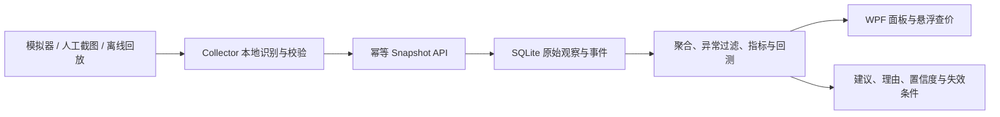

# MH 开发方案

更新日期：2026-08-14

## 1. 技术路线

- 运行平台：Windows，.NET 10。
- 桌面端：WPF，客户端与采集器分进程。
- 本地服务：ASP.NET Core Minimal API。
- 数据库：SQLite + EF Core，日期统一存储为 UTC。
- OCR：后续使用 RapidOcrNet 中文模型，全程本地处理。
- 测试：xUnit + ASP.NET Core 集成测试；模拟数据固定随机种子。

保持模块数量有限，不为尚未出现的需求提前建立插件系统或分布式服务。

## 2. 模块职责

| 项目 | 当前职责 | 后续职责 |
| --- | --- | --- |
| `MH.Core` | 领域模型、DTO、确定性模拟器、日线聚合、上传指纹 | 指标、异常过滤、建议、回测 |
| `MH.Server` | SQLite、种子数据、目录/走势/上传/健康 API、事件研究、跨事件归纳、跨区标准化和区服代理指标 | 配合 OCR/采集数据闭环 |
| `MH.Client` | 只读 API 客户端、WPF 单商品走势/建议、活动观察、跨事件/跨区比较和区服代理指标 | OCR 调试和悬浮查价 |
| `MH.Collector` | 本地 manifest/图片目录回放和候选复核状态展示 | 截图/OCR、状态机、断点恢复和通知 |
| `MH.Tests` | Core 与 API 集成测试 | 分析、OCR、状态机和端到端测试 |

## 3. 数据流



原始观察值不可被分析过程覆盖。清洗结果和指标应可从原始数据重算；算法版本变化时生成新结果而不是修改历史输入。

## 4. 数据契约与质量规则

每次快照至少包含批次 ID、区服、采集时间、来源以及商品价格和数量。上传指纹用于重试幂等，同一批次 ID 对应不同载荷时返回冲突。

后续 OCR 扩展需要增加原图本地路径或哈希、识别区域、文本、置信度、候选商品和人工确认状态。低置信度数据默认不进入建议计算；原始截图默认不离开本机，并支持按保留期清理。

时间一律在边界层转换为 UTC。展示时再使用用户时区。所有区服、商品和批次外键必须通过目录校验。

## 5. 分析实现顺序

1. 建立按日聚合的独立确定性测试数据集。
2. 用中位数和 `MAD = median(|x - median(x)|)` 标记异常；当 MAD 为零时使用明确的零离差规则，不能除零。
3. 计算 7/30 日稳健中位数、收益率、EWMA、波动率、可见供给变化和数据新鲜度。
4. 先实现可解释规则分数，再考虑统计或机器学习模型。规则权重和阈值必须版本化。
5. 回测以时间滚动切分；特征只读取决策时点以前的数据，交易成本和流动性约束显式计入。
6. 只有样本量、覆盖天数、异常率和回测稳定度达到门槛时才启用建议。

建议分数建议归一化到 `[-100, 100]`，同时单独保存置信度 `[0, 1]`。分数代表方向，置信度代表证据质量，二者不可混为一个字段。

当前 `recommendation-rules-v1` 固定口径：7/30 日窗口各至少 3 个样本和内点；有效数据年龄不超过 48 小时；趋势阈值为 ±3%；任一窗口波动率达到 0.25 时回避；可见供给变化阈值为 ±25%。`MaxSuggestedPosition` 表示执行动作后该商品占可用交易资金的目标最大比例，绝对上限为 25%；候选买入随正向证据增强而上升，候选卖出随负向证据增强而下降。该规则只是可回测的 v1 基线，未通过滚动回测门槛前不能作为真实资金建议启用。

当前滚动回测只做多、不允许卖出开空仓。每个决策只读取 `EndUtc <= decisionAt` 的日线，信号在下一根日线 `Open` 执行；最后一根无下一根日线时只记录决策、不成交。`CandidateBuy/CandidateSell` 调整到规则目标仓位，`Avoid/DataInsufficient` 清仓，`Observe/Hold` 不交易。目标数量按执行日开盘的成交前权益反解，并把交易成本和滑点造成的权益减少纳入计算，交易后目标仓位不超过 25%。回测输出逐次记录、最终权益、总收益、最大回撤、换手、决策数和交易数；命中率需先定义无歧义的完整平仓周期，本节点暂不输出。

`backtest-quality-gate-v1` 至少需要 3 个互不重叠窗口，每窗覆盖 30 天、20 次决策和 3 次交易；盈利窗口比例至少 2/3，收益中位数至少 2%，平均换手不超过 1.0。最坏回撤不超过 20% 才可小额试用，20%–35% 仅研究，超过 35% 禁用；任一窗口收益低于 -10% 仅研究，达到 -25% 禁用；整体平均收益非正或规则版本不一致也禁用。`TrialEligible` 仅代表可进行小额人工监督试用，不构成真实获利保证。

只读建议预览端点要求显式 `asOfUtc`，数据库查询限制在 `[asOfUtc-151天, asOfUtc]`，用于 3 个相接但不重叠的 40 天窗口、30 天预热和 1 天边界补偿。固定研究假设为初始资金 100000、交易成本率 1%、滑点率 0.5%。响应同时返回原始建议、门禁状态/理由/摘要和假设；仅当门禁为 `TrialEligible` 且动作是候选买入/卖出时 `isActionable=true`，其它状态一律不可执行。结果不写入数据库。

当前活动事件影响研究节点固定口径：`EventImpactAnalyzer` 只接受 `EndsAtUtc > StartsAtUtc`、不重复且为完整一日的 `PriceBar`；分析时统一转换为 UTC，只纳入 `EndUtc <= asOfUtc` 的日线。`windowDays` 缺失或空白时默认为 7，显式值允许 3–30，阶段使用半开区间 `Before=[StartsAtUtc-windowDays, StartsAtUtc)`、`During=[StartsAtUtc, EndsAtUtc)`、`After=[EndsAtUtc, EndsAtUtc+windowDays)`。价格先排除 `HasOcrAnomaly`，再用中位数/MAD 三倍过滤，MAD 为零时只保留等于中位数的样本，至少 3 个内点才给稳健中位价；在售数量继续使用完整日线 `Volume`，阶段至少 3 根才给中位数，OCR 异常日仍计入数量。每阶段返回请求/有效观察窗口、完整性、可用性、原因、原始根数、OCR 排除数、价格内点数/稳健中位价、数量样本数/中位数；活动中和活动后的价格变化、在售数量变化分别与各自活动前基线独立比较，并分别返回价格或在售数量比较不可用原因。

WPF 活动观察接入固定查询 `[asOfUtc-30天, asOfUtc+30天)`，客户端只保留 `Holiday`/`SupplyChange`，并按进行中、最近结束、最近开始的优先级选择一个重点活动，只请求一次默认窗口影响结果；`DayNight`/`OcrAnomaly` 不进入玩家日历或走势图。活动 API 独立失败时保留主行情状态；仅当上一份快照属于同一 `server/item` 时才保留同市场上一份活动数据，否则活动数据置空并显示“活动资料暂时不可用”。单个活动阶段少于 3 个有效日线时显示样本不足，不推导必涨必跌或买卖结论。

跨事件归纳使用 `event-pattern-summary-v1`，固定同一 `server/item/eventType`，只统计已结束且不晚于 `asOfUtc` 的历史活动；价格和在售数量分别按活动中/活动后计算中位变化、上涨/下跌/基本不变计数和方向一致度。历史范围、事件数量和窗口均有上限，任一维度少于 3 个可比较活动时只返回样本不足；客户端展示为“相似活动历史归纳”，不转成买卖动作。归纳 API 独立失败时不改变主行情状态，也不复用不同市场、类型或历史截点的旧结果。

跨区比较使用 `cross-server-event-standardization-v1`，只接受同一商品和 `Holiday`/`SupplyChange`。每个区先用活动前稳健中位价计算活动中/后相对变化，再取该区多个历史活动的中位数；最终对区服级中位数等权计算跨区中位数、P25、P75、方向计数和一致度，避免活动较多的区服支配结果。价格与在售数量独立处理，至少 2 个可比较区服才标记 `Available`。查询固定 `historyDays`、`windowDays`、`maxServers` 和 `maxEventsPerServer` 上限，只读取 `EndsAtUtc <= asOfUtc` 的活动和 `EndUtc <= asOfUtc` 的日线；客户端失败或样本不足时只显示安全提示，不复用不同商品、类型或历史截点的旧结果。DEMO 当前只有 1 个区服，不伪造跨区数据。

事件 API 为 `GET /api/v1/markets/{serverId}/{itemId}/events?fromUtc=...&toUtc=...&type=...` 和 `GET /api/v1/markets/{serverId}/{itemId}/events/{eventId}/impact?asOfUtc=...&windowDays=...`。事件列表要求带 offset 的 UTC 时间、范围不超过 366 天，按半开区间重叠过滤并按开始时间/事件 ID 排序；影响查询只读取三阶段所需的有界观察区间，并在数据库条件中截断 `ObservedAtUtc <= asOfUtc`。这些接口只输出研究事实，不输出盈利或买卖结论。

客户端通过接口化 `HttpClient` 消费目录、走势、指标、建议和事件端点；区服/商品/事件路径段必须编码，所有历史时点在请求边界统一为 UTC。第一屏 ViewModel 使用 `Idle/Loading/Ready/Offline/Error` 状态和请求代次，后发请求会取消旧请求，即使旧请求忽略取消也不能覆盖新结果。联网失败时保留最后成功快照并标记陈旧；在线数据年龄超过 `recommendation-rules-v1` 的 48 小时上限也视为陈旧。只有 `Ready`、非陈旧且服务端 `isActionable=true` 时客户端才显示为可执行，否则候选买卖降为观察。

WPF 启动时先加载 DEMO 目录，再通过首个商品的完整日线末点确定默认历史时点，不硬编码商品 ID 或模拟日期。客户端服务地址默认 `http://localhost:5002/`，可用 `MH_SERVER_BASE_URL` 覆盖；为避免相对 API 路径歧义，覆盖值只接受根路径的绝对 HTTP/HTTPS 地址。价格图使用 WPF 本地自绘，不引入图表包；异常 OCR 日只做显式标记。

第一屏产品语言面向游戏商行玩家，不把用户假设为证券交易者。主区显示最近完成日线的收盘参考价、当日高低、相对 7 日常见价、近 7 日价格方向、稳定性、在售数量变化和囤货参考；“当前参考价”必须同时说明它来自最近采集样本，不是官方实时最低价。价格相对 7 日常见价使用 ±5% 分档，方向使用 ±3%，稳定性使用 8%/18%，在售数量变化使用 ±5%/±25%；这些只属于版本化展示解释，不改变底层建议规则。回测门禁、方向分数、原始比例和版本只放在进阶折叠区。

## 6. 区服比较方案

先在区服内将价格变化、供给和高价值品流动性标准化，再比较跨区分位数，避免因不同区服绝对价格差异得出错误结论。

活跃度和高价值需求都先输出无量纲指数。要转换为人数区间，必须获得同时期可验证样本进行校准，并在 UI 展示训练区间、误差和最后校准日期。

`server-market-profile-v1` 固定读取 `[asOfUtc-7天, asOfUtc]` 的原始观察并隔离未来数据。活跃度以目录覆盖 20%、采集日覆盖 10%、可见在售数量变化频率 35% 和非 OCR 异常价格变化频率 35% 加权；某类变化少于 6 个连续样本时移除该分量并按剩余权重归一化。高价值样本按各商品至少 3 次有效价格观察的中位数计算区内 P75 门槛，至少需要 3 个高价值商品；需求代理以这些商品的可见在售数量收缩频率 65% 和收缩时价格保持频率 35% 形成。两个分数均限制在 0–100，低于 40 为低、40–70 为中、70 及以上为高；数据年龄超过 48 小时、覆盖不足或变化样本不足时不返回分数。可见数量变化不等于挂单身份变化或真实成交。

范围决策：跨商品建议榜和个人仓位已由用户明确取消，不建立相应 API、持久化或界面。

## 7. 采集状态机

计划状态：`Idle`、`Observing`、`Capturing`、`Recognizing`、`ReviewRequired`、`PausedForLogin`、`PausedForUpdate`、`PausedForCaptcha`、`Disconnected`、`UnknownPage`、`Stopped`。

只有白名单页面且置信度达到门槛时才能从观察进入截图/识别。登录、更新、验证码、掉线和未知页面不能触发自动点击；只能保存诊断信息、停止操作并通知人工。

## 8. 测试与交付门禁

每个阶段合入前必须满足：

```powershell
dotnet build MH.slnx -c Release
dotnet test MH.Tests\MH.Tests.csproj -c Release
```

阶段 2 额外验证确定性回测、时间边界和离线模式；WPF 第一屏和活动观察卡已完成人工验收。阶段 3 验证低置信度行为、截图不上传、DPI 和 P95；阶段 4 验证所有停止状态与端到端回放；阶段 5 验证自包含 Windows 发布。

## 9. Git 工作方式

- `main` 保持可构建、可测试；每个可验收节点独立提交。
- 功能分支建议使用 `feature/analytics`、`feature/dashboard` 等明确名称。
- 提交前检查差异范围，不提交 `bin`、`obj`、数据库和原始截图。
- 一个提交只承载一个可说明的节点；测试修复应与触发它的功能一起提交。
- 远端使用 SSH：`git@github.com:piusohu98/MH.git`。
