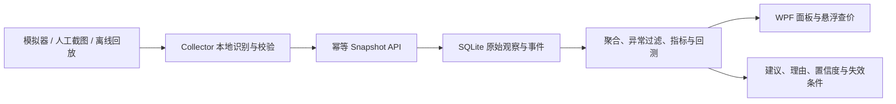

# MH 开发方案

更新日期：2026-08-13

## 1. 技术路线

- 运行平台：Windows，.NET 10。
- 桌面端：WPF，客户端与采集器分进程。
- 本地服务：ASP.NET Core Minimal API。
- 数据库：SQLite + EF Core，日期统一存储为 UTC。
- OCR：后续使用 RapidOcrNet 中文模型，全程本地处理。
- 测试：xUnit + ASP.NET Core 集成测试；模拟数据固定随机种子。

保持模块数量有限，不为尚未出现的需求提前建立插件系统或分布式服务。

## 2. 模块职责

| 项目 | 当前职责 | 后续职责 |
| --- | --- | --- |
| `MH.Core` | 领域模型、DTO、确定性模拟器、日线聚合、上传指纹 | 指标、异常过滤、建议、回测 |
| `MH.Server` | SQLite、种子数据、目录/走势/上传/健康 API | 分析查询、事件学习、仓位数据 |
| `MH.Client` | 可编译 WPF 壳 | 仪表板、图表、日历、建议和仓位 |
| `MH.Collector` | 可编译 WPF 壳 | 截图/OCR、状态机、回放和通知 |
| `MH.Tests` | Core 与 API 集成测试 | 分析、OCR、状态机和端到端测试 |

## 3. 数据流



原始观察值不可被分析过程覆盖。清洗结果和指标应可从原始数据重算；算法版本变化时生成新结果而不是修改历史输入。

## 4. 数据契约与质量规则

每次快照至少包含批次 ID、区服、采集时间、来源以及商品价格和数量。上传指纹用于重试幂等，同一批次 ID 对应不同载荷时返回冲突。

后续 OCR 扩展需要增加原图本地路径或哈希、识别区域、文本、置信度、候选商品和人工确认状态。低置信度数据默认不进入建议计算；原始截图默认不离开本机，并支持按保留期清理。

时间一律在边界层转换为 UTC。展示时再使用用户时区。所有区服、商品和批次外键必须通过目录校验。

## 5. 分析实现顺序

1. 建立按日聚合的独立确定性测试数据集。
2. 用中位数和 `MAD = median(|x - median(x)|)` 标记异常；当 MAD 为零时使用明确的零离差规则，不能除零。
3. 计算 7/30 日稳健中位数、收益率、EWMA、波动率、可见供给变化和数据新鲜度。
4. 先实现可解释规则分数，再考虑统计或机器学习模型。规则权重和阈值必须版本化。
5. 回测以时间滚动切分；特征只读取决策时点以前的数据，交易成本和流动性约束显式计入。
6. 只有样本量、覆盖天数、异常率和回测稳定度达到门槛时才启用建议。

建议分数建议归一化到 `[-100, 100]`，同时单独保存置信度 `[0, 1]`。分数代表方向，置信度代表证据质量，二者不可混为一个字段。

当前 `recommendation-rules-v1` 固定口径：7/30 日窗口各至少 3 个样本和内点；有效数据年龄不超过 48 小时；趋势阈值为 ±3%；任一窗口波动率达到 0.25 时回避；可见供给变化阈值为 ±25%。`MaxSuggestedPosition` 表示执行动作后该商品占可用交易资金的目标最大比例，绝对上限为 25%；候选买入随正向证据增强而上升，候选卖出随负向证据增强而下降。该规则只是可回测的 v1 基线，未通过滚动回测门槛前不能作为真实资金建议启用。

当前滚动回测只做多、不允许卖出开空仓。每个决策只读取 `EndUtc <= decisionAt` 的日线，信号在下一根日线 `Open` 执行；最后一根无下一根日线时只记录决策、不成交。`CandidateBuy/CandidateSell` 调整到规则目标仓位，`Avoid/DataInsufficient` 清仓，`Observe/Hold` 不交易。目标数量按执行日开盘的成交前权益反解，并把交易成本和滑点造成的权益减少纳入计算，交易后目标仓位不超过 25%。回测输出逐次记录、最终权益、总收益、最大回撤、换手、决策数和交易数；命中率需先定义无歧义的完整平仓周期，本节点暂不输出。

`backtest-quality-gate-v1` 至少需要 3 个互不重叠窗口，每窗覆盖 30 天、20 次决策和 3 次交易；盈利窗口比例至少 2/3，收益中位数至少 2%，平均换手不超过 1.0。最坏回撤不超过 20% 才可小额试用，20%–35% 仅研究，超过 35% 禁用；任一窗口收益低于 -10% 仅研究，达到 -25% 禁用；整体平均收益非正或规则版本不一致也禁用。`TrialEligible` 仅代表可进行小额人工监督试用，不构成真实获利保证。

## 6. 区服比较方案

先在区服内将价格变化、供给和高价值品流动性标准化，再比较跨区分位数，避免因不同区服绝对价格差异得出错误结论。

活跃度和高价值需求都先输出无量纲指数。要转换为人数区间，必须获得同时期可验证样本进行校准，并在 UI 展示训练区间、误差和最后校准日期。

## 7. 采集状态机

计划状态：`Idle`、`Observing`、`Capturing`、`Recognizing`、`ReviewRequired`、`PausedForLogin`、`PausedForUpdate`、`PausedForCaptcha`、`Disconnected`、`UnknownPage`、`Stopped`。

只有白名单页面且置信度达到门槛时才能从观察进入截图/识别。登录、更新、验证码、掉线和未知页面不能触发自动点击；只能保存诊断信息、停止操作并通知人工。

## 8. 测试与交付门禁

每个阶段合入前必须满足：

```powershell
dotnet build MH.slnx -c Release
dotnet test MH.Tests\MH.Tests.csproj -c Release
```

阶段 2 额外验证确定性回测、时间边界和离线模式；阶段 3 验证低置信度行为、截图不上传、DPI 和 P95；阶段 4 验证所有停止状态与端到端回放；阶段 5 验证自包含 Windows 发布。

## 9. Git 工作方式

- `main` 保持可构建、可测试；每个可验收节点独立提交。
- 功能分支建议使用 `feature/analytics`、`feature/dashboard` 等明确名称。
- 提交前检查差异范围，不提交 `bin`、`obj`、数据库和原始截图。
- 一个提交只承载一个可说明的节点；测试修复应与触发它的功能一起提交。
- 远端使用 SSH：`git@github.com:piusohu98/MH.git`。
